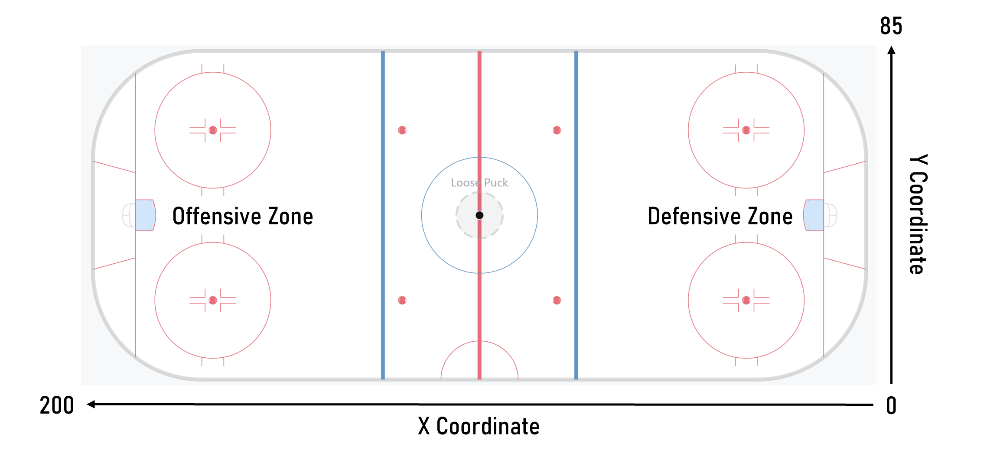

<h1>Big Data Cup Submission Guidelines</h1>

 
<h2>Submission Rules & Guidelines:</h2>

Maximum 6 pages, including figures (size limit 10GB on submission)

Format of submission:

<ul>
  <li>Define your thesis </li>
  <li>Provide a summary of your methodology</li>
  <li>Give an overview of your findings</li>
  <li>Identify key action points from your analysis</li>
  <li>Code may be included as an appendix</li>
</ul>
 

<h1>Dataset</h1>
<h2>Summary</h2>

The dataset is comprised of Stathletes-tracked women’s hockey event data from the Olympics and NCAA, as well as player tracking data generated from broadcast video. The included events have been translated from Stathletes’ raw data to enhance accessibility and interpretability. The various event types include shots, plays, takeaways, puck recoveries, dump ins, dump outs, zone entries, faceoffs and penalties. Event definitions may slightly differ from other sources. For each event, expanded details are provided and the relevant skaters and teams involved are indicated when necessary.

**NEW**: Tutorial on play-by-play, plotting, and tracking in R can be found [here](OTTHAC_Tutorial/)

 

<h2>Tracking Data from Broadcast Video</h2>

Tracking data and documentation is [here](TrackingData/).

**NEW**: Tutorial on merging tracking and play-by-play data can be found [here](TrackingData/join_tracking_pbp.ipynb).

 

<h2>Contextual (Event) Data</h2>

[International Games](../main/pxp_womens_oly_2022_v2.csv) | [NCAA Games](../main/hackathon_womens.csv) | [NWHL Games](../main/hackathon_nwhl.csv)

<ul>
  <li>Date (e.g. ‘2020-12-23’. Format = ‘yyyy-mm-dd’)</li>
  <li>Home Team (e.g. ‘Toronto Maple Leafs’)</li>
  <li>Away Team (e.g. ‘Boston Bruins’)</li>
  <li>Period (range from 1-3 for regulation, 4+ for overtime)</li>
  <li>Clock (e.g. ‘19:34’. Format = ‘mm:ss’)</li>
  <li>Home Team Skaters (range from 3-6 for home skaters currently on the ice)</li>
  <li>Away Team Skaters (range from 3-6 for away skaters currently on the ice)</li>
  <li>Home Team Goals (current goals scored by the home team at the time of the event)</li>
  <li>Away Team Goals (current goals scored by the away team at the time of the event)</li>
  <li>Team (name of the team responsible for the event)</li>
  <li>Player (name of the player responsible for the event)</li>
  <li>Event (type of event, e.g. ‘Play’, ‘Shot’, …)</li>
  <li>X Coordinate (x-coordinate of where an event occurred on the ice, between 0 and 200)</li>
  <li>Y Coordinate (y-coordinate of where an event occurred on the ice, between 0 and 85)</li>
    <ul>
      <li>Coordinates are always from the perspective of the eventing team</li>
    </ul>
  </li>
  </ul>
</img>
 <ul>
 <li>Detail 1-4 (up to 4 supplementary details for each event, varies by event type)</li>
 <li>Player 2 (name of a secondary player involved in an event, varies by event type)</li>
 <li>X Coordinate 2 (x-coordinate of a secondary event detail, varies by event)</li>
 <li>Y Coordinate 2 (y-coordinate of a secondary event detail, varies by event)</li>

</ul>

 

<h2>Events</h2>
<h3>Shot</h3>

Shot attempts that are unsuccessful (block, miss or save)

Players Involved

<ul>
  <li>Player: Shooter </li>
</ul>

Coordinates

<ul>
  <li>X,Y Coordinate: Release location </li>
</ul>

Event Details

<ul>
  <li>Detail 1: Shot Type (Deflection, Fan, Slapshot, Snapshot, Wrap around, Wristshot)</li>
  <li>Detail 2: Shot destination (on net, missed or blocked)</li>
  <li>Detail 3: Traffic (true or false)</li>
  <li>Detail 4: One timer (true or false)</li>
</ul>
 

<h3>Goal</h3>

Shot attempts that are successful (goal)

Players Involved

<ul>
  <li>Player: Shooter </li>
</ul>

Coordinates

<ul>
  <li>X,Y Coordinate: Release location of the puck </li>
</ul>

Event Details

<ul>
  <li>Detail 1: Shot Type (Deflection, Fan, Slapshot, Snapshot, Wrap around, Wristshot)</li>
  <li>Detail 2: Shot destination (on net, missed or blocked)</li>
  <li>Detail 3: Traffic (true or false)</li>
  <li>Detail 4: One timer (true or false)</li>
</ul>
 

<h3>Play</h3>

Pass attempts that are successful

Event Types

<ul>
  <li>Direct (e.g. a tape-to-tape pass)</li>
  <li>Indirect (e.g. a pass that is rimmed along the boards) </li>
</ul>

Players Involved

<ul>
  <li>Player: Passer </li>
  <li>Player 2: Intended pass target</li>
</ul>

Coordinates

<ul>
  <li>X,Y Coordinate: Pass release location</li>
  <li>X,Y Coordinate: Pass target location</li>
</ul>

Event details

Detail 1: Pass Type

<ul>
  <li>Direct (eg. a tape-to-tape pass)</li>
  <li>Indirect (eg. a pass that is rimmed around the boards)</li>
</ul>
 

<h3>Incomplete Play</h3>

Pass attempts that are unsuccessful

Event Types

<ul>
  <li>Direct (e.g. a tape-to-tape pass)</li>
  <li>Indirect (e.g. a pass that is rimmed along the boards) </li>
</ul>

Players Involved

<ul>
  <li>Player: Passer </li>
  <li>Player 2: Intended pass target</li>
</ul>

Coordinates

<ul>
  <li>X,Y Coordinate: Pass release location</li>
  <li>X,Y Coordinate: Pass target location</li>
</ul>

Event details

Detail 1: Pass Type

<ul>
  <li>Direct (eg. a tape-to-tape pass)</li>
  <li>Indirect (eg. a pass that is rimmed around the boards)</li>
</ul>
 

<h3>Takeaway</h3>

Steals, pass interceptions and won battles that lead to a change in possession

Players Involved

<ul>
  <li>Player: Skater credited with the takeaway </li>
</ul>

Coordinates

<ul>
  <li>X,Y Coordinate: Location where the skater gained possession when taking the puck away</li>
</ul>
 

<h3>Puck Recovery</h3>

Possession gains initiated by retrieving a loose puck that was created by a missed/blocked/saved shot, an advance (e.g. dump-out/dump-in), a faceoff or a broken play

Players Involved

<ul>
  <li>Player: Skater who recovered the puck</li>
</ul>

Coordinates

<ul>
  <li>X,Y Coordinate: Location where skater gained possession</li>
</ul>
 
<h3>Dump In/Out</h3>

Actions in which a skater intentionally concedes possession by advancing the puck up ice

Players Involved

<ul>
  <li>Player: Skater who dumped/advanced the puck</li>
</ul>

Coordinates

<ul>
  <li>X,Y Coordinate: Location where skater released the puck</li>
</ul>

Event details

<ul>
  <li>Detail 1: Possession Outcome (Retained, Lost)</li>
</ul>

 
<h3>Zone Entry</h3>

Attempts to move the puck into the offensive zone from the neutral zone

Players Involved

<ul>
  <li>Player: Entry skater</li>
  <li>Player 2: Targeted defender</li>
</ul>

Coordinates

<ul>
  <li>X,Y Coordinate: Point of release for dumps/advances, point where puck crossed the blueline for passes and carries</li>
</ul>

Event details

<ul>
  <li>Detail 1: Entry Type (Carried, Dumped, Played)</li>
</ul>

 
<h3>Faceoff Win</h3>

Faceoffs

Players Involved

<ul>
  <li>Player:  Skater who won the draw</li>
  <li>Player 2: Skater who lost the draw</li>
</ul>

Coordinates

<ul>
  <li> X,Y Coordinate: Location of faceoff dot</li>
</ul>

 
<h3>Penalty Taken</h3>

Infractions

Players Involved

<ul>
  <li>Player: Skater who took the penalty</li>
  <li>Player 2: Skater who drew the penalty</li>
</ul>

Coordinates

<ul>
  <li>X,Y Coordinate: Location of infraction</li>
</ul>

Event Details

<ul>
  <li>Detail 1: Infraction Type (e.g. Slashing, Tripping, Roughing, Hooking, ...)</li>
</ul>

