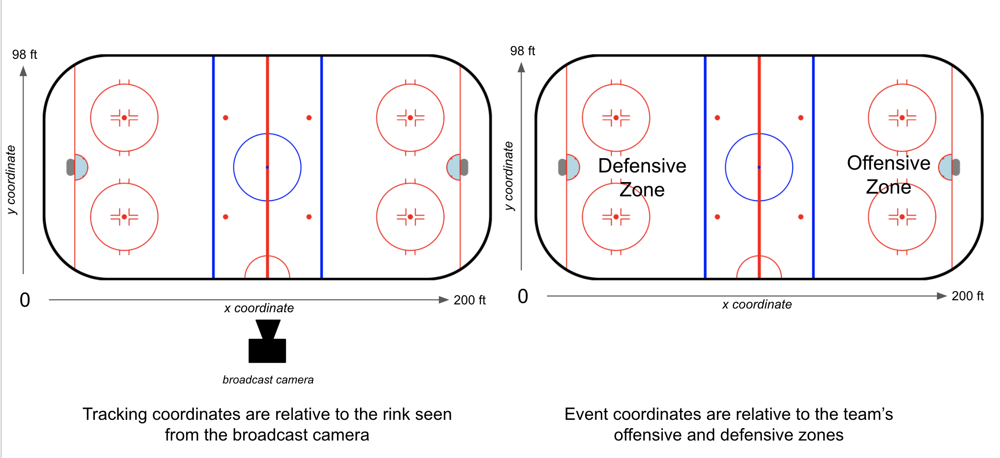

# Player Tracking from Broadcast Video

The dataset contains 34 power plays from 6 2022 international women's hockey games.

| **Game**              | **Phase** | **# of Power Plays** |
|-----------------------|-----------|----------------------|
| 2022-02-08 CAN at USA | Prelim    | 6                    |
| 2022-02-08 ROC at FIN | Prelim    | 6                    |
| 2022-02-12 SUI at ROC | QF        | 4                    |
| 2022-02-14 FIN at USA | SF        | 5                    |
| 2022-02-14 SUI at CAN | SF        | 5                    |
| 2022-02-16 SUI at FIN | Bronze    | 8                    |

## Sample Output

## Tracking Coordinates vs. Event Coordinates

## Data Description

- Only players within the field of view of the broadcast camera are visible at any given time
- Detection is only performed for video from the main broadcast camera. Skipped frames in the data likely mean that the camera angle switched (e.g., commercial, replay, camera behind the net)

**NEW**: Tutorial on merging tracking and play-by-play data can be found [here](join_tracking_pbp.ipynb).

### `pp_info.csv`

| **Column**                                         | **Description**                                                                                                                                                            |
|----------------------------------------------------|----------------------------------------------------------------------------------------------------------------------------------------------------------------------------|
| `game_name`                                          | Date and teams.                                                                                                                                                            |
| `penalty_number`                                     | Index of the power play in the game.                                                                                                                                       |
| `start_video_clock_seconds`, `end_video_clock_seconds` | Timestamp of the start of the power play (faceoff after situation change) and end of the power play (situation change to even strength) for the whole video of the period. |
| `start_period`, `end_period`                          | Start and end periods of the power play.                                                                                                                                   |
| `start_game_clock_seconds`, `end_game_clock_seconds`   | Game clock at the start of the power play (faceoff after situation change) and end of the power play (situation change to even strength) in seconds.                       |

### `<game name>/<power play video name>.csv`

| **Column**    | **Description**                                                                                                                                                                                                    |
|---------------|--------------------------------------------------------------------------------------------------------------------------------------------------------------------------------------------------------------------|
| `frame_id`      | The index of the frame in the whole input video (30 fps). Note: frame IDs start at 1.                                                                                                                              |
| `period`        | The period of the powerplay.                                                                                                                                                                                       |
| `track_id`      | The index of the player track detected. This does not correspond with the jersey number of the player, but rather a unique identifier of an associated sequence of player detections. Note: player IDs start at 1. |
| `team_id`       | Light or Dark.                                                                                                                                                                                                     |
| `team_name`     | The team name of the player.                                                                                                                                                                                       |
| `jersey_number` | Detected jersey number of the player. Players with jersey number 100 mean that no jersey number was detected for that player.                                                                                      |
| `x_ft`, `y_ft`    | Position of the player on the ice rink.                                                                                                                                                                            |

### `<game name>/videoShotsInfo_<power play video name>.csv`

| **Column**                               | **Description**                                                                                                                                                                                                                |
|------------------------------------------|--------------------------------------------------------------------------------------------------------------------------------------------------------------------------------------------------------------------------------|
| `shot_ind`                                 | The index of the shot. Note: shot indices start at 1. Shots refer to sequences of video that are from the main broadcast camera. Missing shot indices refer to sequences of video that are not from the main broadcast camera. |
| `frame_start_shot`, `frame_end_shot`         | The index of the start and end frames of the shot. Note: frame indices start at 1 and the video is 30 fps.                                                                                                                     |
| `time_start_shot(sec)`, `time_end_shot(sec)` | The timestamp of the start and end frames of the shot.                                                                                                                                                                         |

### `<game name>/<game name> roster.csv`

| **Column** | **Description**                                                            |
|------------|----------------------------------------------------------------------------|
| player     | First and last name of the player.                                         |
| jn         | Jersey number of the player.                                               |
| position   | The player’s position (Defense, Goalie, Center, Left Wing, or Right Wing). |
| team       | Home or away.                                                              |

## References

- M. Yazdi and M. Fani, "Shot boundary detection with effective prediction of transitions' positions and spans by use of classifiers and adaptive thresholds," 2016 24th Iranian Conference on Electrical Engineering (ICEE), 2016, [https://ieeexplore.ieee.org/abstract/document/7585511](https://ieeexplore.ieee.org/abstract/document/7585511)
- K. Vats, W. McNally, P. Walters, D. Clausi, and J. Zelek, “Ice hockey player identification via transformers,” arXiv, 2021, [https://arxiv.org/abs/2111.11535](https://arxiv.org/abs/2111.11535)
- K. Vats, P. Walters, M. Fani, D. Clausi, and J. Zelek, “Player Tracking and Identification in Ice Hockey,” arXiv, 2021, [https://arxiv.org/abs/2110.03090](https://arxiv.org/abs/2110.03090)
- M. Fani, P. Walters, D. Clausi, J. Zelek, and A. Wong, “Localization of Ice-Rink for Broadcast Hockey Videos,” Poster in WiCV2021, 2021, [https://arxiv.org/abs/2104.10847](https://arxiv.org/abs/2104.10847)

